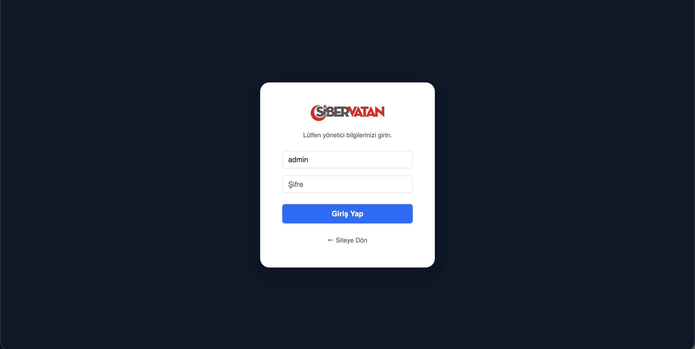

# 🛡️ Siber Vatan Blog Yönetim Paneli

Bu proje, **Siber Vatan Programı** ön eleme aşaması için geliştirilmiş, Node.js tabanlı bir içerik yönetim sistemi (CMS) çalışmasıdır. Proje; backend mimarisi, güvenli oturum yönetimi ve kurumsal kimlik entegrasyonu yetkinliklerini kanıtlamak amacıyla hazırlanmıştır.

## 🛠️ Teknik Özellikler
* **Backend:** Node.js & Express.js tabanlı sunucu altyapısı.
* **Oturum Yönetimi:** `express-session` ile güvenli admin giriş kontrolü.
* **Veri Yönetimi:** JSON formatında yerel dosya sistemi (FS) entegrasyonu (CRUD).
* **Arayüz:** Bootstrap 5 ve Bootstrap Icons ile modern, responsive tasarım.
* **Fonksiyonellik:** Modal (Popup) üzerinden anlık yazı düzenleme, içerik önizleme ve görünürlük (Kamu/Gizli) ayarı.

## 🚀 Kurulum ve Çalıştırma
1. Bağımlılıkları yüklemek için:

   npm install

2. Uygulamayı başlatmak için::
   
   node server.js

3. Tarayıcıdan erişmek için:
http://localhost:3000

Admin Giriş Bilgileri:
URL: /login
Kullanıcı Adı: admin
Şifre: 1234

📸 Proje Akışı ve Ekran Görüntüleri

<i>1. Yönetici Giriş Ekranı: Siber Vatan kurumsal renklerine uygun arayüz.</i>

<i>2. Ana Sayfa (Yazısız): Projenin ilk açılış hali.</i>

<i>3. Ana Sayfa (İçerik Eklenmiş): Dinamik içerik görünümü.</i>

<i>4. Admin Yönetim Paneli: Yazı ekleme, silme ve listeleme merkezi.</i>

<i>5. Düzenleme ve Önizleme: Sayfa yenilemeden çalışan Modal arayüzü.</i>

Geliştirici: Can Sarıhan

Görev: Siber Vatan Ön Eleme Projesi